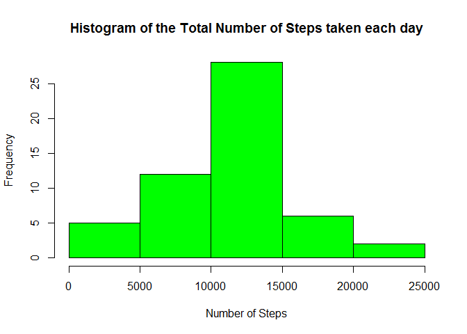
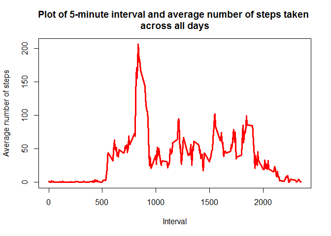
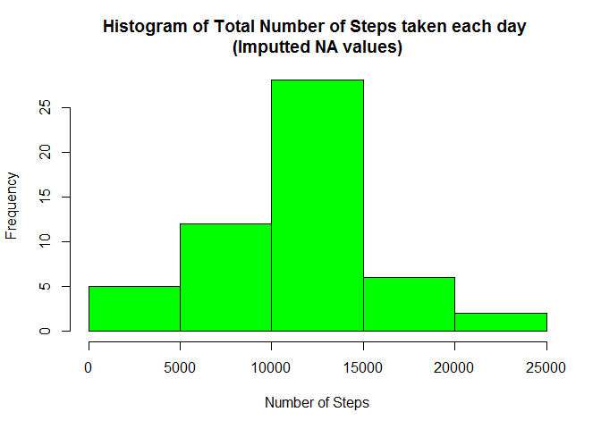
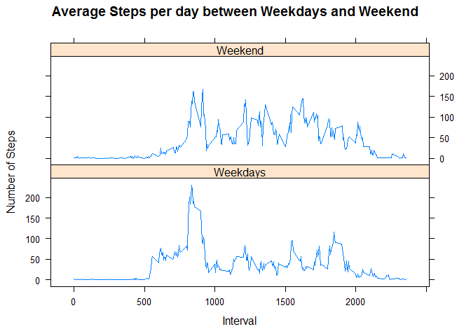

# Reproducible Research: Peer Assessment 1

***
## Loading and preprocessing the data


Download, unzip and load the data into the data frame

```r
download.file("https://d396qusza40orc.cloudfront.net/repdata%2Fdata%2Factivity.zip",destfile = "activity.zip")
unzip("activity.zip")
activity<-read.csv("activity.csv",header=TRUE)
```

Examine the structure of the activity data frame

```r
str(activity)
```

```
## 'data.frame':	17568 obs. of  3 variables:
##  $ steps   : int  NA NA NA NA NA NA NA NA NA NA ...
##  $ date    : Factor w/ 61 levels "2012-10-01","2012-10-02",..: 1 1 1 1 1 1 1 1 1 1 ...
##  $ interval: int  0 5 10 15 20 25 30 35 40 45 ...
```

Preprocess the date field in the activity data frame

```r
activity$date<-as.Date(activity$date)
```

Examine the structure of the activity data frame after preprocessing

```r
str(activity)
```

```
## 'data.frame':	17568 obs. of  3 variables:
##  $ steps   : int  NA NA NA NA NA NA NA NA NA NA ...
##  $ date    : Date, format: "2012-10-01" "2012-10-01" ...
##  $ interval: int  0 5 10 15 20 25 30 35 40 45 ...
```


***
## What is mean total number of steps taken per day?


Calculate the total number of steps taken per day using the aggregate function

```r
total_step_per_day<-aggregate(steps~date,sum,data=activity,na.rm=TRUE)
```

Plot the histogram of the total number of steps taken each day

```r
hist(total_step_per_day$steps,main="Histogram of the Total Number of Steps taken each day",col="green",xlab="Number of Steps")
```

<!-- -->

Calculate and report the mean of the total number of steps taken per day

```r
mean_steps<-mean(total_step_per_day$steps,na.rm=TRUE)
mean_steps
```

```
## [1] 10766.19
```

Calculate and report the median of the total number of steps taken per day

```r
median_steps<-median(total_step_per_day$steps,na.rm=TRUE)
median_steps
```

```
## [1] 10765
```


***
## What is the average daily activity pattern?


Calculate the average steps per interval

```r
average_steps_per_interval<-aggregate(steps~interval,mean,data=activity)
```

Plot the 5-minute interval and the average number of steps taken, averaged across all days

```r
plot(average_steps_per_interval$interval,average_steps_per_interval$steps,type="l",lwd=3,col="red",main="Plot of 5-minute interval and average number of steps taken \nacross all days",xlab="Interval",ylab="Average number of steps")
```

<!-- -->

Find the interval with the maximum average steps

```r
average_steps_per_interval[which.max(average_steps_per_interval$steps),]
```

```
##     interval    steps
## 104      835 206.1698
```


***
## Imputing missing values


Calculate and reoprt the total number of missing values in the dataset

```r
no_of_na_rows<-sum(!complete.cases(activity))
no_of_na_rows
```

```
## [1] 2304
```

Create a new dataset that is equal to the original dataset

```r
new_activity<-activity
```

Using the mean for the 5-min interval (average_steps_per_interval data frame) to populate the NA values for a given interval

```r
new_activity <- transform(new_activity, steps = ifelse(is.na(new_activity$steps), average_steps_per_interval$steps[match(new_activity$interval, average_steps_per_interval$interval)], new_activity$steps))
```

Calculate and report the total number of missing values in the dataset

```r
no_of_na_rows_new<-sum(!complete.cases(new_activity))
no_of_na_rows_new  
```

```
## [1] 0
```

Calculate the total number of steps taken per day using the aggregate function (after imputing missing values)

```r
total_step_per_day_new<-aggregate(steps~date,sum,data=new_activity,na.rm=TRUE)
```

Plot the histogram of the total number of steps taken each day (after imputing missing values)

```r
hist(total_step_per_day$steps,main="Histogram of Total Number of Steps taken each day \n(Imputted NA values)",col="green",xlab="Number of Steps")
```

<!-- -->

Calculate and report the mean of the total number of steps taken per day (after imputing missing values)

```r
mean_steps_new<-mean(total_step_per_day_new$steps,na.rm=TRUE)
mean_steps_new
```

```
## [1] 10766.19
```

Calculate and report the median of the total number of steps taken per day (after imputing missing values)

```r
median_steps_new<-median(total_step_per_day_new$steps,na.rm=TRUE)
median_steps_new
```

```
## [1] 10766.19
```

> __It can be seen that the mean remains the same but there is a slight difference in median. The imputing of missing values in the dataset has some minor impact on the median.__


***
## Are there differences in activity patterns between weekdays and weekends?


Create a new factor variable in the dataset with two levels - "weekday" and "weekend" indicating whether a given data is weekday or weekend day

```r
weekdays<-c("Monday","Tuesday","Wednesday","Thursday","Friday")
new_activity$day<-as.factor(ifelse(is.element(weekdays(new_activity$date),weekdays),"Weekdays","Weekend"))
```

Calculate the average number of steps per interval across weekday days and weekend days

```r
steps_per_interval_day<-aggregate(steps~interval+day,mean,data=new_activity)
```

Plot a line graph of the 5-minute interval and the average number of steps taken, averaged across all weekday days or weekend days

```r
library(lattice)
xyplot(steps_per_interval_day$steps~steps_per_interval_day$interval|steps_per_interval_day$day,type="l",layout=c(1,2),main="Average Steps per day between Weekdays and Weekend",xlab="Interval",ylab="Number of Steps")
```

<!-- -->

> __It can be interpreted from the graph that the object is more active in the earlier day during the Weekday but averagely the object is more active throughout the Weekend.__
